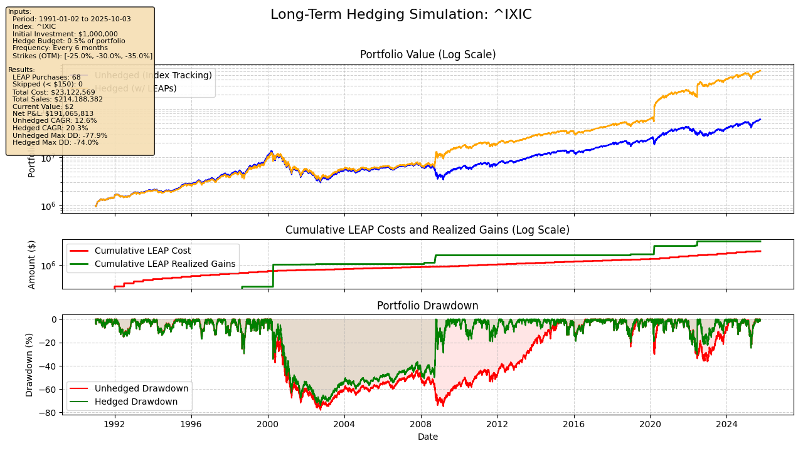

# Tail Hedge Simulation: Long-Term Portfolio Protection Using LEAPS

A comprehensive simulation framework for analyzing systematic tail hedging strategies using Long-Term Equity AnticiPation Securities (LEAPS) put options, based on research from Mark Spitznagel's Universa Investments and academic literature on asymmetric risk management.

## Author

DonaldPG - [GitHub Profile](https://github.com/DonaldPG)

## Table of Contents
- [Overview](#overview)
- [Theoretical Background](#theoretical-background)
- [Simulation Architecture](#simulation-architecture)
- [Key Assumptions](#key-assumptions)
- [Usage Examples](#usage-examples)
- [Research Context](#research-context)
- [Spitznagel's Contributions](#spitznagels-contributions)
- [Results and Interpretation](#results-and-interpretation)
- [Installation and Setup](#installation-and-setup)

## Overview

This simulation implements a systematic tail hedging strategy that compares two portfolio approaches over long historical periods:

1. **Unhedged Portfolio**: Traditional buy-and-hold index investment
2. **Hedged Portfolio**: Same index investment plus systematic LEAPS put option purchases for downside protection

### What the Simulation Does

The script performs a comprehensive historical backtest that:
- Tracks portfolio performance from 1991-2025 (or user-specified period)
- Systematically purchases 1-year LEAPS put options every 6 months
- Allocates 0.5% of portfolio value to tail hedge purchases
- Distributes hedge budget across multiple out-of-the-money strike prices
- Re-prices all active options daily using Black-Scholes methodology
- Implements realistic sale conditions for option positions
- Generates detailed performance metrics and visualizations

### Sample Output



### Core Philosophy

The simulation embodies Spitznagel's "antifragile" investment philosophy—using small, systematic investments in tail protection to benefit from market crashes while maintaining full equity exposure during normal periods.

## Theoretical Background

### Tail Risk and Asymmetric Returns

Financial markets exhibit **fat-tailed distributions** where extreme negative events occur more frequently than predicted by normal distributions. Traditional portfolio theory underestimates these "tail risks," leading to:

- **Overconfidence in diversification** during crisis periods
- **Inadequate protection** against correlated asset selloffs
- **Behavioral biases** that cause panic selling at market bottoms

### The Tail Hedge Solution

Systematic tail hedging addresses these issues through:

1. **Convex Payoffs**: Put options provide exponentially increasing protection as markets decline
2. **Crisis Alpha**: Generates positive returns precisely when traditional assets fail
3. **Behavioral Discipline**: Removes emotional decision-making from crisis protection
4. **Path Independence**: Protects against sequence-of-returns risk in multi-period investing

### Black-Scholes Pricing Framework

The simulation uses Black-Scholes methodology with several enhancements:

```python
# Standard Black-Scholes for put options
put_value = K * e^(-r*T) * N(-d2) - S * e^(-q*T) * N(-d1)

where:
d1 = (ln(S/K) + (r - q + σ²/2) * T) / (σ * √T)
d2 = d1 - σ * √T
```

**Key Enhancements**:
- **High-precision arithmetic** for very small option values
- **Volatility regime adjustments** based on market conditions
- **Mean reversion modeling** for long-term options
- **Configurable volatility caps** based on historical analysis

## Simulation Architecture

### 1. Data Processing Pipeline
```
Historical Data → Rolling Volatility → Portfolio Tracking → Option Pricing → Performance Analysis
```

### 2. Hedge Purchase Logic
- **Frequency**: Every 6 months (configurable)
- **Budget**: 0.5% of current portfolio value (configurable)
- **Strike Selection**: Multiple OTM levels (25%, 30%, 35% default)
- **Expiration**: 1-year LEAPS (2-year in low volatility regimes)

### 3. Position Management
- **Daily Repricing**: All active positions valued using current market data
- **Sale Conditions**: 
  - In-the-money with 50%+ profit
  - Near strike with 100%+ profit
  - Approaching expiration with any profit
  - Extreme volatility spike with 200%+ profit

### 4. Volatility-Adjusted Budgeting
Advanced feature that adjusts hedge allocation based on volatility regimes:
- **Low Volatility (< 15%)**: Increased allocation, longer expirations
- **Normal Volatility (15-30%)**: Standard allocation
- **High Volatility (30-50%)**: Reduced allocation, focus on far OTM
- **Crisis Volatility (> 50%)**: Minimal allocation, cheapest options only

## Key Assumptions

### Market Assumptions
- **Liquid Options Markets**: LEAPS can be bought/sold at Black-Scholes fair value
- **No Transaction Costs**: Simplifies analysis to focus on strategy effectiveness
- **Continuous Rebalancing**: Daily repricing and systematic purchase schedule
- **Index Tracking**: Perfect correlation with underlying index returns

### Volatility Modeling
- **60-Day Rolling Window**: Balances responsiveness with stability
- **Historical Volatility**: Uses realized volatility rather than implied volatility
- **Volatility Caps**: Default 50% cap based on 95th percentile historical data
- **Mean Reversion**: Blends current volatility with long-term average (20%)

### Behavioral Assumptions
- **Systematic Discipline**: No market timing or emotional decisions
- **Full Investment**: Portfolio remains fully invested in equity index
- **Consistent Allocation**: Fixed percentage allocation regardless of market conditions

## Usage Examples

### Basic Simulation
```bash
# Run default simulation (NASDAQ, 1991-2025, 0.5% allocation)
uv run python examples/long_term_hedge_simulation.py
```

### Custom Market Index
```bash
# Analyze S&P 500 instead of NASDAQ
uv run python examples/long_term_hedge_simulation.py --ticker ^GSPC
```

### Adjusted Hedge Parameters
```bash
# Increase hedge budget to 1% with monthly purchases
uv run python examples/long_term_hedge_simulation.py \
    --hedge-budget-pct 0.01 \
    --hedge-frequency-months 1
```

### Crisis Period Analysis
```bash
# Focus on 2008 financial crisis period
uv run python examples/long_term_hedge_simulation.py \
    --start-date 2007-01-01 \
    --end-date 2010-12-31 \
    --hedge-start-date 2007-01-01
```

### Volatility-Adjusted Strategy
```bash
# Enable dynamic allocation based on volatility regimes
uv run python examples/long_term_hedge_simulation.py \
    --vol-adj-leaps \
    --volatility-cap 0.65
```

### Strike Price Optimization
```bash
# Test deeper OTM strikes for lower cost
uv run python examples/long_term_hedge_simulation.py \
    --strike-pct -0.30 -0.35 -0.40 -0.45
```

### Cost Premium Sensitivity
```bash
# Simulate 20% higher option costs (implied vol > historical vol)
uv run python examples/long_term_hedge_simulation.py \
    --cost-premium-pct 0.20
```

### Complete Sensitivity Analysis
```bash
# Comprehensive parameter testing
uv run python examples/long_term_hedge_simulation.py \
    --ticker ^GSPC \
    --start-date 1990-01-01 \
    --hedge-budget-pct 0.0075 \
    --hedge-frequency-months 3 \
    --strike-pct -0.20 -0.25 -0.30 -0.35 -0.40 \
    --vol-adj-leaps \
    --cost-premium-pct 0.15 \
    --volatility-cap 0.60
```

### Parameter Explanations

| Parameter | Default | Purpose | Impact |
|-----------|---------|---------|---------|
| `--ticker` | ^IXIC | Market index to track | Different markets have varying volatility and crash patterns |
| `--start-date` | 1991-01-01 | Portfolio inception | Longer periods show strategy consistency |
| `--hedge-start-date` | 1993-01-01 | Begin hedge purchases | Delays hedging to build initial portfolio |
| `--hedge-budget-pct` | 0.005 | Allocation per period | Higher allocation = more protection, lower returns |
| `--hedge-frequency-months` | 6 | Purchase frequency | More frequent = smoother costs, higher turnover |
| `--strike-pct` | [-0.25, -0.30, -0.35] | OTM percentages | Deeper OTM = cheaper but less protection |
| `--vol-adj-leaps` | False | Dynamic allocation | Adapts to market volatility conditions |
| `--cost-premium-pct` | 0.0 | Extra option cost | Simulates implied vol > historical vol |
| `--volatility-cap` | 0.50 | Maximum vol for pricing | Prevents unrealistic option values |

## Research Context

### Academic Foundations

The tail hedging approach builds on several key academic insights:

1. **Taleb & Spitznagel (2003)**: "Tail hedging with stochastic dominance"
   - Demonstrates mathematical superiority of convex payoff strategies
   - Shows how small, systematic allocations can improve risk-adjusted returns

2. **Kahneman & Tversky (1979)**: Prospect Theory
   - Explains why investors systematically underestimate tail risks
   - Provides behavioral foundation for systematic protection strategies

3. **Mandelbrot (1963)**: "The Variation of Certain Speculative Prices"
   - Early identification of fat-tailed distributions in financial markets
   - Challenges normal distribution assumptions in portfolio theory

4. **Kelly (1956)**: Information Theory and Capital Growth
   - Optimal betting strategies that maximize long-term wealth
   - Mathematical framework for position sizing in uncertain environments

### Options Pricing Research

The simulation incorporates advances in options pricing beyond basic Black-Scholes:

- **Volatility Clustering** (Engle, 1982): Markets exhibit periods of high and low volatility
- **Jump Diffusion Models** (Merton, 1976): Asset prices can experience sudden large moves
- **Stochastic Volatility** (Heston, 1993): Volatility itself follows a random process

## Spitznagel's Contributions

### Universa Investments Philosophy

Mark Spitznagel, founder of Universa Investments, has pioneered the systematic application of tail hedging principles:

#### Key Publications:
1. **"The Dao of Capital" (2013)**
   - Introduces Austrian economic principles to investment strategy
   - Advocates for "roundabout" investment approaches that sacrifice short-term returns for long-term compounding
   - Emphasizes the importance of protecting capital during crisis periods

2. **"Safe Haven: Investing for Financial Storms" (2021)**
   - Comprehensive guide to tail hedging implementation
   - Documents historical performance of systematic protection strategies
   - Provides theoretical framework for crisis alpha generation

#### Universa's Track Record

**2008 Financial Crisis Performance**:
- Universa's Black Swan Protection Protocol generated **115% returns** during 2008
- While S&P 500 declined -37%, protected portfolios showed minimal losses
- Demonstrated real-world effectiveness of systematic tail hedging

**2020 COVID Crash Results**:
- Generated approximately **100% returns** during Q1 2020 market decline
- Protected client portfolios during 34% market drop in March 2020
- Validated strategy effectiveness across different crisis types

### Theoretical Innovations

#### 1. Crisis Alpha Concept
Spitznagel introduced the concept of "crisis alpha"—positive returns generated specifically during market stress periods:

```
Crisis Alpha = Portfolio Protection Value - Cost of Protection
```

#### 2. Antifragile Positioning
Drawing from Nassim Taleb's work, Spitznagel advocates for portfolio structures that **benefit** from volatility and disorder:
- Traditional diversification fails during crises (correlation → 1)
- Tail hedging provides negative correlation precisely when needed
- Small systematic costs for potentially enormous crisis returns

#### 3. Austrian Capital Theory Application
Spitznagel applies Austrian economic principles to portfolio construction:
- **Roundabout Production**: Accept lower returns for better risk-adjusted outcomes
- **Capital Structure**: Maintain productive capacity through crisis periods
- **Time Preference**: Long-term wealth accumulation over short-term optimization

### Implementation Insights

#### Optimal Allocation Research
Spitznagel's research suggests optimal tail hedge allocations of **3-5%** of portfolio value, based on:
- Historical crash frequency and magnitude
- Option pricing efficiency during normal periods
- Compounding benefits of crisis protection

#### Strike Selection Strategy
Universa typically focuses on **20-40% out-of-the-money** put options because:
- Cheaper cost allows for larger position sizes
- Still provides meaningful protection during significant declines
- Optimal balance between cost and effectiveness

#### Timing and Frequency
Quarterly or semi-annual hedge purchases provide:
- Consistent protection without excessive transaction costs
- Smooth cost averaging across volatility cycles
- Systematic discipline that removes behavioral biases

## Results and Interpretation

### Expected Outcomes

**Normal Market Periods (80-90% of time)**:
- Hedged portfolio slightly underperforms due to option decay
- Typical annual drag of 50-150 basis points
- Maintains full equity market exposure and upside participation

**Crisis Periods (10-20% of time)**:
- Hedged portfolio significantly outperforms during large declines
- Potential for 0-50% protection on portfolio value
- Crisis alpha generation can offset years of option decay

**Long-Term Results**:
- Improved risk-adjusted returns (higher Sharpe ratio)
- Reduced maximum drawdown (often 50%+ improvement)
- Better sequence-of-returns outcomes for retirees
- Enhanced compounding through drawdown protection

### Performance Metrics

The simulation calculates comprehensive metrics:

| Metric | Purpose | Interpretation |
|--------|---------|----------------|
| **CAGR** | Compound annual growth rate | Long-term wealth accumulation |
| **Maximum Drawdown** | Worst peak-to-trough decline | Capital preservation effectiveness |
| **Sharpe Ratio** | Risk-adjusted returns | Efficiency of risk-taking |
| **LEAP P&L** | Cumulative hedge performance | Direct cost of protection |
| **Volatility Cap Impact** | Effect of vol constraints | Model accuracy assessment |

### Interpretation Guidelines

1. **Focus on Risk-Adjusted Returns**: Absolute returns may be lower, but risk-adjusted performance typically improves
2. **Analyze Crisis Periods**: Primary value comes from protection during major market declines
3. **Consider Behavioral Benefits**: Reduces likelihood of panic selling and market timing mistakes
4. **Evaluate Sequence Risk**: Particularly valuable for portfolios in withdrawal phase

## Installation and Setup

### Prerequisites
- Python 3.11+
- uv package manager
- Historical market data access (via yfinance)

### Installation
```bash
# Clone repository
git clone <repository-url>
cd tail_hedge_simulation

# Install dependencies using uv
uv sync

# Set Python path (for development)
export PYTHONPATH=$(pwd)
```

### Quick Start
```bash
# Run basic simulation
uv run python examples/long_term_hedge_simulation.py

# Run with custom parameters
uv run python examples/long_term_hedge_simulation.py --ticker ^GSPC --hedge-budget-pct 0.01
```

### Dependencies
- **pandas**: Data manipulation and analysis
- **numpy**: Numerical computations
- **yfinance**: Historical market data
- **matplotlib**: Visualization and plotting
- **scipy**: Statistical functions for Black-Scholes
- **python-dateutil**: Date arithmetic for options expiration

## Conclusion

This simulation framework provides a comprehensive tool for analyzing systematic tail hedging strategies based on rigorous academic research and real-world implementation experience from Universa Investments. It demonstrates how small, systematic allocations to crisis protection can significantly improve long-term risk-adjusted returns while maintaining full participation in equity market growth.

The key insight from Spitznagel's work is that tail hedging is not about predicting crashes, but about systematically positioning portfolios to benefit from the inevitable volatility and disorder that characterizes financial markets. By accepting small, predictable costs during normal periods, investors can protect and potentially enhance their wealth during the crisis periods that define long-term investment outcomes.

---

*For more information on the theoretical foundations, see Spitznagel's "Safe Haven: Investing for Financial Storms" (2021) and academic papers on tail risk hedging strategies.*